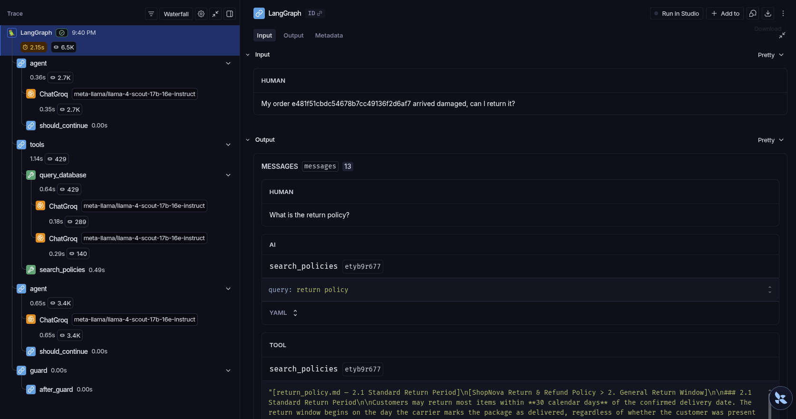

[](https://github.com/k-arvanitis/orion-agent/actions/workflows/ci.yml)


# Orion — AI Customer Support Agent

https://github.com/user-attachments/assets/5b2548d6-74d0-4000-a1c0-d3a8dcf71b86

---

## Demo

The recording above covers four query types:

| Timestamp | Query type | What it demonstrates |
|---|---|---|
| 0:00 – 0:20 | Policy (RAG only) | Agent retrieves return policy chunk from Qdrant, cites source heading in the trace panel |
| 0:21 – 0:50 | Order lookup (SQL only) | Text2SQL generates a validated SELECT, executes against Supabase, returns structured result |
| 0:51 – 1:20 | Multi-tool | Agent calls both tools in sequence — trace panel shows tool call order, retrieved chunks, and the SQL that ran |
| 1:21 – 1:40 | Escalation | Slack alert and Gmail confirmation fire independently — both tool calls visible in the trace |

The right panel in the UI is the LangSmith tool trace — tool selection decisions, latency per step, and retrieved chunks are visible in real time alongside the streamed response.

---

Orion is a production-minded AI agent for e-commerce customer support. It answers natural language questions by routing them to the right data source, handles multi-step queries that require both structured and unstructured data, and escalates unresolvable issues by alerting the human operator via Slack and sending a confirmation email to the customer via Gmail.

Built on a fictional Brazilian e-commerce store (ShopNova) using the real [Olist dataset](https://www.kaggle.com/datasets/olistbr/brazilian-ecommerce). Policy documents are synthetic (AI-generated) and modelled on real Brazilian e-commerce regulations. Order data is real.

---

## Tracing

Every agent run is traced in LangSmith — tool decisions, latency, token usage, and guard checks.



---

## Architecture

```
User query
    │
    ▼
┌──────────────────────────────────────────────────────┐
│                LangGraph ReAct Agent                  │
│                  (OrionState per thread_id)           │
│                                                       │
│  ┌──────────────┐  ┌──────────────┐  ┌────────────┐  │
│  │  RAG Tool    │  │  SQL Tool    │  │ Escalation │  │
│  │              │  │              │  │   Tool     │  │
│  │ Qdrant Cloud │  │  Supabase    │  │Slack+Gmail │  │
│  │ dense+sparse │  │  Text2SQL    │  │            │  │
│  └──────────────┘  └──────────────┘  └────────────┘  │
│         │                │                            │
│         └──── structured JSON response ───────────────┤
│                  {"answer": ..., "chunks/sql": ...}    │
│                                                       │
│  ┌────────────────────────────────────────────────┐   │
│  │  Guard Layer (PII strip + hallucination check) │   │
│  │  → re-prompts agent on hallucination detected  │   │
│  └────────────────────────────────────────────────┘   │
└──────────────────────────────────────────────────────┘
    │
    ▼
Response + LangSmith trace
```

The agent runs a ReAct loop: it decides which tool(s) to call, executes them, and synthesizes a response. Tools return structured JSON — the agent sees only the `answer` field, while `chunks` and `sql` are stored in graph state for the UI trace panel. A guard layer runs on every final response before it reaches the user.

---

## Key Engineering Decisions

**Structured tool isolation** — tools return `{"answer": ..., "chunks/sql": ...}`. The agent receives only the `answer` field; raw source data is stored in `OrionState` for the UI trace panel. Prevents the LLM from reasoning about schema internals mid-conversation.

**Numerical hallucination guard with retry** — every number in the final response is cross-checked against raw tool output. On mismatch, the agent is re-prompted once with the flagged discrepancy explicitly stated. If the retry also fails, the cleaned response is returned rather than a hallucinated one.

**Hybrid retrieval over pure semantic search** — policy documents contain exact terms ("30-day return window", "Boleto", "CPF") that dense-only search misses under paraphrase. BM25 handles keyword precision; the dense model handles intent. Both run in parallel via Qdrant prefetch and are fused with RRF — no learned weighting required.

**SELECT-only SQL validation** — generated queries are validated by sqlparse (DML rejection, markdown fence stripping) before execution. On failure, the error is fed back to the LLM for one retry. Natural language SQL injection is tested explicitly in the adversarial eval set.

**Partial failure resilience** — every external dependency degrades independently. Slack and Gmail fire separately in escalation. RAG and SQL tools catch exceptions and return fallback messages without killing the other tool's response. The system never returns a silent empty answer.

---

## Tech Stack

| Component          | Technology                                                              | Why |
|--------------------|-------------------------------------------------------------------------|-----|
| Orchestration      | LangGraph — stateful ReAct agent with custom `OrionState`               | Stateful graph with explicit node/edge routing; per-thread OrionState allows session isolation without external state management |
| LLM                | Groq — Llama 4 Scout 17B (`meta-llama/llama-4-scout-17b-16e-instruct`)  | Fast inference via Groq; OpenAI-compatible API allows swapping models via env var without code changes; Llama 4 Scout handles tool use reliably at this scale |
| RAG                | Qdrant Cloud — hybrid dense + sparse search with RRF fusion             | Qdrant Cloud: no local infra to manage; native hybrid search (dense + sparse) with RRF fusion in a single query; better retrieval quality than pgvector for this use case |
| Dense embeddings   | nomic-embed-text (768-dim) via Ollama                                   | Local inference via Ollama — document content never leaves the machine at embedding time |
| Sparse embeddings  | BM25 via fastembed (`Qdrant/bm25`)                                      | BM25 catches exact keyword matches (order IDs, policy terms like "Boleto", "CPF") that semantic search misses |
| Database           | Supabase PostgreSQL — Olist dataset, 9 tables                           | Supabase: managed Postgres with no infra overhead; SQLAlchemy for type-safe query execution |
| Text2SQL           | Llama 4 Scout + sqlparse validation + SQLAlchemy execution              | Schema-aware prompt + SELECT-only validation via sqlparse + one retry on failure — three layers of safety before a query reaches the DB |
| Escalation         | Gmail API (OAuth2) + Slack Incoming Webhooks                            | Gmail OAuth2 + Slack webhooks are independent — one failing does not block the other |
| Observability      | LangSmith — traces every agent run                                      | LangSmith traces every agent run: tool decisions, latency, token usage, guard checks — queryable after the fact |
| Evaluation         | LangSmith + RAGAS + LLM-as-judge                                        | RAGAS for retrieval quality + LLM-as-judge for answer correctness + exact match for tool selection — three complementary signals |
| UI                 | Streamlit — streaming chat + tool trace sidebar                         | Streamlit: fastest path to a working demo; tool trace sidebar exposes agent internals without a separate backend |

---

## Tools

### `search_policies` — Hybrid RAG over policy documents

Embeds the query with **nomic-embed-text** (dense, 768-dim) and **BM25** (sparse, keyword-level). Qdrant runs both searches in parallel via prefetch, then fuses the ranked results with **Reciprocal Rank Fusion (RRF)** — no learned weighting needed. Returns the top 4 chunks.

Why hybrid: policy documents contain exact terms ("30-day return window", "Boleto", "CPF") that pure semantic search can miss. BM25 catches exact keyword matches; the dense model handles paraphrase and intent.

Returns `{"answer": "<formatted chunks>", "chunks": [{"source", "heading", "content"}]}`.

### `query_database` — Text2SQL over order data

Sends the question + full schema context to Llama 4 Scout, which generates a PostgreSQL SELECT query. The query is validated by **sqlparse** (SELECT-only whitelist) before execution. On failure, the error is fed back to the LLM for one retry. Results are interpreted back into natural language by the same LLM.

Returns `{"answer": "<natural language response>", "sql": "<query that ran>"}`.

### `escalate` — Human handoff

Triggered when the agent cannot resolve an issue or the customer asks for a human. Fetches full order details from Supabase (with `STRING_AGG` for split-payment orders), sends a confirmation email to the customer via the **Gmail API** (OAuth2), and posts an urgent alert to the operator **Slack** channel. Both calls are independent — if one fails, the other still fires.

---

## Guard Layer

Every agent response passes through a two-step filter before reaching the user:

1. **PII stripping** — regex removes Brazilian CPF numbers (`\b\d{3}\.\d{3}\.\d{3}-\d{2}\b`) and phone numbers (`\(\d{2}\)\s*\d{4,5}-\d{4}`) silently.
2. **Hallucination check** — every number in the response is extracted and cross-checked against the raw tool output. Any number not present in the source is flagged, and the agent is re-prompted with a correction message. If the retry also fails, the cleaned (but incomplete) response is returned.

---

## Per-session State

Each conversation is identified by a `thread_id`. The LangGraph state (`OrionState`) stores messages, `last_chunks`, and `last_sql` per session — so the UI trace panel is always scoped to the current user's conversation and never bleeds between sessions.

---

## Setup

### Prerequisites
- Python 3.11
- [uv](https://docs.astral.sh/uv/)
- [Ollama](https://ollama.com/) running locally with `nomic-embed-text` pulled:
  ```bash
  ollama pull nomic-embed-text
  ```

### Install
```bash
git clone https://github.com/karvanitis/orion-agent
cd orion-agent
uv sync --frozen
```

### Environment variables
```bash
cp .env.example .env
```

Required keys:
```
DATABASE_URL=postgresql://...
QDRANT_URL=https://...
QDRANT_API_KEY=...
GROQ_API_KEY=...
LANGCHAIN_API_KEY=...
SLACK_WEBHOOK_URL=https://hooks.slack.com/...
```

For Gmail escalation, run the one-time OAuth flow:
```bash
uv run --frozen python scripts/auth_gmail.py
```
Gmail access tokens refresh automatically when `token.json` contains a refresh
token; if that refresh token is revoked or missing, re-run the auth script.

### Ingest policies into Qdrant
```bash
make ingest
```

---

## Quick Start

```bash
make ui      # Streamlit chat UI
make run     # CLI agent
make test    # run all tests
make eval    # LangSmith evaluation (skips escalation)
```

---

## Quality Gates

Ruff is configured in `pyproject.toml`:

```toml
[tool.ruff]
line-length = 88
target-version = "py311"

[tool.ruff.lint]
select = ["E", "F", "I"]
```

CI runs `uv run ruff check .` before the test suite.

---

## Docker

The Docker setup runs the Streamlit UI and Ollama in containers. Your Qdrant Cloud and Supabase connections are provided via `.env` — no local database needed.

```bash
cp .env.example .env   # fill in your keys
make docker-build      # build the UI image
make docker-up         # start UI (port 8501) + Ollama (port 11434)
make docker-setup      # one-time: pull nomic-embed-text into the Ollama container
```

Then open `http://localhost:8501`.

> **Note:** The containers do not include your Qdrant or Supabase data. You need to run `make ingest` locally (or point to an already-populated Qdrant collection) before the RAG tool returns results.

---

## Example Questions

**Order lookup (SQL)**
```
What is the status of order 416e49799e9260d93c8f636ce6661a55?
How much did I pay for order 1e8c81805b92ff169971231458670460?
```

**Policy lookup (RAG)**
```
What payment methods does ShopNova accept?
How long do I have to return a product?
```

**Multi-tool (SQL + RAG)**
```
My order arrived late — am I eligible for a refund?
I want to return order e481f51cbdc54678b7cc49136f2d6af7. How much will I get back?
```

**Escalation**
```
I want to speak to a real person. My email is customer@example.com.
```

---

## Evaluation

The eval harness runs **120 labeled question-answer pairs** across 6 categories. Dataset generated with Claude Sonnet as a generation tool, then manually reviewed for correctness.

**Dataset breakdown:**

| Category      | Count | Description                                                                                         |
|---------------|-------|-----------------------------------------------------------------------------------------------------|
| `rag_only`    | 40    | Policy questions — returns, warranties, shipping rules, payment terms                               |
| `sql_only`    | 35    | Order-specific questions — status, delivery dates, payments, freight values                         |
| `both`        | 30    | Mixed questions requiring both order facts and policy rules (e.g. "my order arrived damaged, can I return it?") |
| `edge_case`   | 6     | Corner cases — non-returnable items, expired boletos, late deliveries outside policy window         |
| `escalation`  | 4     | Frustrated customers and explicit human handoff requests                                            |
| `adversarial` | 5     | Prompt injection, out-of-scope questions, SQL injection in natural language, PII in query           |

**Scoring:**

Each example is scored with up to 6 metrics. RAGAS metrics only apply to `rag_only` and `both` categories where chunks are retrieved.

| Metric             | Method                                                              | Applies to |
|--------------------|---------------------------------------------------------------------|------------|
| Correctness        | LLM-as-judge (Llama 4 Scout) — scores 0–1 against expected answer  | All        |
| Tool selection     | Exact match against expected tool set                               | All        |
| Faithfulness       | RAGAS — is the answer grounded in retrieved chunks?                 | RAG rows   |
| Answer relevancy   | RAGAS — does the answer address the question?                       | RAG rows   |
| Context precision  | RAGAS — are retrieved chunks relevant?                              | RAG rows   |
| Context recall     | RAGAS — were all relevant chunks retrieved?                         | RAG rows   |

**Results (orion-v1, 111 examples, escalation skipped):**

| Metric             | Score | Examples |
|--------------------|-------|----------|
| Correctness        | 0.71  | 111      |
| Tool selection     | 0.90  | 111      |
| Faithfulness       | 0.76  | 64       |
| Context precision  | 0.75  | 64       |
| Context recall     | 0.73  | 64       |
| Answer relevancy   | 0.75  | 64       |

**Tool selection accuracy (0.90)** is the strongest signal: the agent routes to the correct tool 9 out of 10 times with no explicit classifier. **Correctness (0.71)** means the agent is useful but not production-ready: the main failure mode is `both`-category questions where it retrieves policy and order data but does not reliably combine them before answering; next step is a policy+order hybrid prompt that explicitly chains both tool outputs before generation.

```bash
uv run --frozen python eval/run_eval.py --skip-escalation --experiment orion-v1
# smoke test
uv run --frozen python eval/run_eval.py --skip-escalation --limit 5
```

---

## Failure Modes

| Failure                | Behaviour                                                                                                    |
|------------------------|--------------------------------------------------------------------------------------------------------------|
| **Groq rate limit**    | 429 error surfaced by LangGraph. Use `--limit 5` for smaller eval runs or switch `AGENT_MODEL` in `.env`.   |
| **Qdrant unreachable** | `search_policies` catches the exception and returns *"Policy search temporarily unavailable."* SQL still works. |
| **Ollama not running** | Dense embedding fails; same fallback message. Run `ollama serve` and ensure `nomic-embed-text` is pulled.   |
| **Supabase / DB down** | `query_database` retries once then returns *"Unable to retrieve that information."* RAG still works.         |
| **Gmail OAuth expired**| Access tokens refresh automatically when `token.json` includes a refresh token; if the refresh token is revoked or missing, `escalate` logs the Gmail error, Slack still fires as the monitoring hook, and `scripts/auth_gmail.py` must be re-run manually. |
| **Slack webhook invalid** | `escalate` logs a warning, Gmail confirmation still sends.                                               |
| **Hallucination detected** | Guard reinjects a correction prompt and retries the agent once.                                        |

---

## Tests

```bash
make test
```

34 tests, no external services required — Groq, Qdrant, Supabase, Gmail, and Slack are all mocked.

| File                       | What it tests                                                          |
|----------------------------|------------------------------------------------------------------------|
| `test_guard.py`            | PII stripping (CPF, phone), hallucination detection, GuardResult flags |
| `test_routing.py`          | `should_continue` and `after_guard` routing logic                      |
| `test_sql_validation.py`   | SELECT-only validation, DML rejection, markdown fence stripping        |
| `test_rag_tool.py`         | Structured JSON response, chunk metadata, Qdrant/Ollama failure fallbacks |
| `test_escalation_tool.py`  | Email validation, Slack/Gmail calls, partial failure resilience        |

---

## Project Structure

```
orion-agent/
├── agent/
│   ├── config.py             # Centralised config — all model names and defaults
│   ├── graph.py              # LangGraph ReAct agent with OrionState
│   ├── guard.py              # PII filter + hallucination check
│   ├── prompts.py            # System prompt with tool reasoning examples
│   └── tools/
│       ├── rag_tool.py       # Hybrid Qdrant search — returns structured JSON
│       ├── sql_tool.py       # Text2SQL over Supabase — returns structured JSON
│       └── escalation_tool.py # Gmail + Slack human handoff
├── ingestion/
│   ├── chunker.py            # Markdown → heading-based chunks
│   ├── ingest.py             # Embed + push to Qdrant (dense + sparse)
│   └── load_customer_data.py # CSV → Supabase with automatic type inference
├── eval/
│   ├── run_eval.py           # LangSmith eval harness (6 metrics, 120 cases)
│   └── dataset.json          # 120 labeled test cases across 6 categories
├── tests/
│   ├── test_guard.py
│   ├── test_routing.py
│   ├── test_sql_validation.py
│   ├── test_rag_tool.py
│   └── test_escalation_tool.py
├── ui/
│   └── app.py                # Streamlit UI with streaming + tool trace sidebar
├── scripts/
│   └── auth_gmail.py         # One-time Gmail OAuth setup
├── data/
│   └── policies/             # Markdown policy documents (4 files)
├── .github/workflows/ci.yml  # CI — runs tests on every push
├── main.py                   # CLI entry point
├── Makefile                  # make run / ui / test / eval / ingest
└── .env.example
```

---

## Known Limitations

- **Hallucination guard is numerical only** — the guard catches numeric mismatches (prices, dates, order IDs) but does not detect semantic hallucinations such as misinterpreted policy rules.
- **In-memory thread state** — `OrionState` is not persisted. A service restart clears all conversation history. For production use, LangGraph's checkpointer interface would need to be wired to a durable store (e.g. Redis or Postgres).
- **Ollama dependency for embeddings** — the Docker setup requires pulling `nomic-embed-text` (~274 MB) into the Ollama container on first run. Swapping to a hosted embedding API (e.g. `text-embedding-3-small`) would remove this dependency at the cost of per-query API calls.
- **Single-tenant eval dataset** — the 120-case eval set was generated from the Olist schema and synthetic ShopNova policies. Scores are not directly comparable to general-purpose customer support benchmarks.
- **Groq rate limits under eval load** — running the full eval concurrently hits Groq's free-tier rate limit. The `--limit` flag exists for this reason. A paid tier or local vLLM endpoint removes this constraint.
