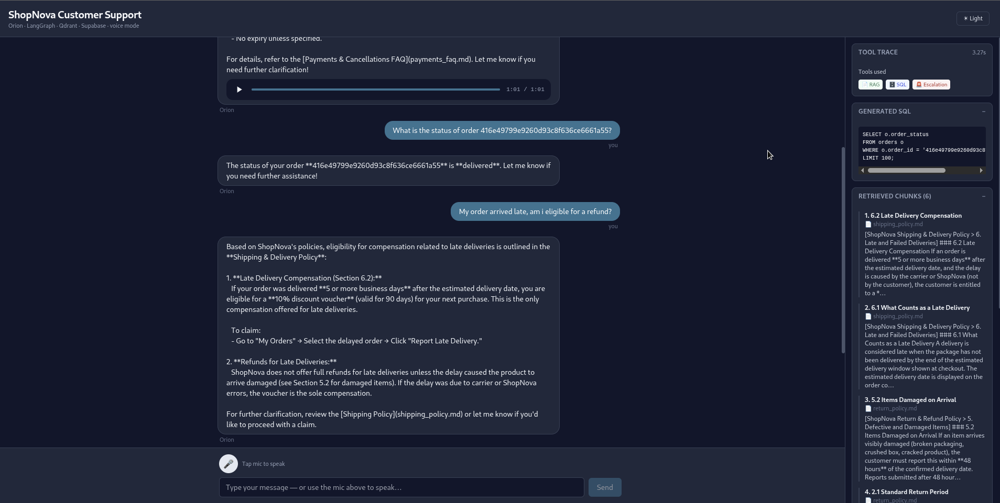
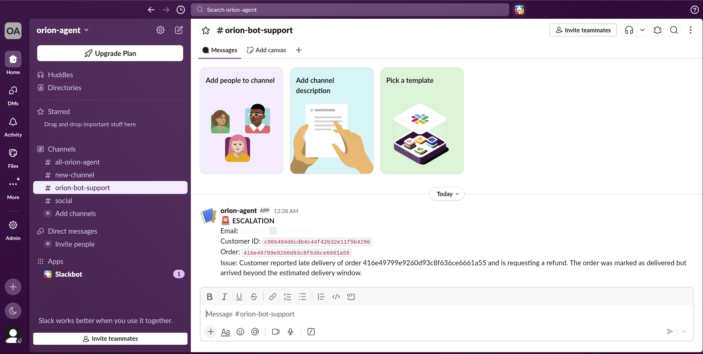
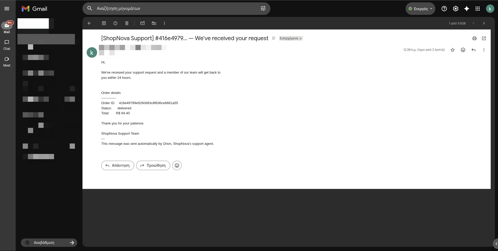

# Orion — AI Customer Support Agent

**Orion deflects ~80% of e-commerce support tickets automatically** — order status lookups, return and policy questions, and combined queries that need both — with sources visible to the customer and a clean human escalation path when needed. No headcount increase required.

Built for e-commerce businesses handling repetitive support volume. Handles order lookups against a live database, policy questions over your documents, and frustrated-customer escalation to Slack + email — all without a human in the loop.

**Who this is for:** E-commerce businesses handling repetitive support volume — order status, returns, policy questions — who want to deflect 80% of tickets without adding headcount.

[](https://github.com/k-arvanitis/orion-agent/actions/workflows/ci.yml)


---

## Demo

[](https://www.loom.com/share/2b3c370f2da647b7a3762e0b1231c09b)



| Timestamp | Query type | What it demonstrates |
|---|---|---|
| 0:00 – 0:20 | Policy (RAG only) | Agent retrieves return policy chunk from Qdrant, cites source heading in the trace panel |
| 0:21 – 0:50 | Order lookup (SQL only) | Text2SQL generates a validated SELECT, executes against Supabase, returns structured result |
| 0:51 – 1:20 | Multi-tool | Agent calls both tools in sequence — trace panel shows tool call order, retrieved chunks, and the SQL that ran |
| 1:21 – 1:40 | Escalation | Slack alert and Gmail confirmation fire independently — both tool calls visible in the trace |

The right panel in the UI is the LangSmith tool trace — tool selection decisions, latency per step, and retrieved chunks are visible in real time alongside the streamed response.

---

**The problem.** Most e-commerce support tickets are not unique — they're the same handful of questions repeated thousands of times: *where is my order, can I return this, what payment methods do you accept, my package arrived damaged*. Each one costs an agent 5–10 minutes; the customer waits hours for a reply they could have had in seconds.

**What Orion deflects automatically.** Order-status lookups, return/warranty/shipping/payment policy questions, and combined questions that need both ("my order arrived late — am I eligible for a refund?"). The agent answers from your live order database and your policy documents, with sources visible to the customer. No human in the loop.

**What it escalates — and how.** Frustrated customers, unresolvable issues, and explicit "I want a human" requests trigger a single escalation flow: a Slack alert with the full order context goes to the support team, and a confirmation email goes to the customer via Gmail. Both fire independently — if Slack is down, the email still sends. The agent never silently drops a ticket.

Built on a fictional Brazilian e-commerce store (ShopNova) using the real [Olist dataset](https://www.kaggle.com/datasets/olistbr/brazilian-ecommerce). Policy documents are synthetic (AI-generated) and modelled on real Brazilian e-commerce regulations. Order data is real.

---

## Tracing

Every agent run is traced in LangSmith — tool decisions, latency, and token usage.


---

## Architecture

```
┌──────────────────────────┐                 ┌──────────────────────────────────┐
│   Next.js 14 frontend    │                 │   FastAPI backend (uvicorn)      │
│   (TypeScript + Tailwind)│                 │                                  │
│                          │                 │  POST /api/chat  → NDJSON stream │
│  ChatPanel ──────────────┼── fetch+stream ─►   {token} ... {token} {trace}   │
│  VoiceRecorder           │                 │  POST /api/transcribe (multipart)│
│   (MediaRecorder)        │                 │  POST /api/tts (→ audio/mpeg)    │
│  TraceSidebar            │                 │                                  │
└──────────────────────────┘                 └──────────────┬───────────────────┘
                                                            │
                                                            ▼
                              ┌──────────────────────────────────────────────────────┐
                              │                LangGraph ReAct Agent                  │
                              │                  (OrionState per thread_id)           │
                              │                                                       │
                              │  ┌──────────────┐  ┌──────────────┐  ┌────────────┐  │
                              │  │  RAG Tool    │  │  SQL Tool    │  │ Escalation │  │
                              │  │ Qdrant Cloud │  │  Supabase    │  │Slack+Gmail │  │
                              │  │ dense+sparse │  │  Text2SQL    │  │            │  │
                              │  └──────────────┘  └──────────────┘  └────────────┘  │
                              │                                                       │
                              │  ┌────────────────────────────────────────────────┐   │
                              │  │  Guard Layer (PII strip)                       │   │
                              │  └────────────────────────────────────────────────┘   │
                              └──────────────────────────────────────────────────────┘
```

The agent runs a ReAct loop: it decides which tool(s) to call, executes them, and synthesizes a response. Tools return structured JSON — the agent sees only the `answer` field, while `chunks` and `sql` are stored in graph state and forwarded to the UI in the final `trace` event. A guard layer runs on every final response before it reaches the user. The frontend is presentation-only: every reasoning step happens behind the FastAPI boundary.

---

## Key Engineering Decisions

**Structured tool isolation** — tools return `{"answer": ..., "chunks/sql": ...}`. The agent receives only the `answer` field; raw source data is stored in `OrionState` for the UI trace panel. Prevents the LLM from reasoning about schema internals mid-conversation.

**PII guard before every response** — every final response passes through a regex filter that silently strips Brazilian CPF numbers and phone numbers before the text reaches the user. The filter runs after the ReAct loop completes and does not affect tool execution.

**Hybrid retrieval over pure semantic search** — policy documents contain exact terms ("30-day return window", "Boleto", "CPF") that dense-only search misses under paraphrase. BM25 handles keyword precision; the dense model handles intent. Both run in parallel via Qdrant prefetch and are fused with RRF — no learned weighting required.

**SELECT-only SQL validation** — generated queries are validated by sqlparse (DML rejection, markdown fence stripping) before execution. On failure, the error is fed back to the LLM for one retry. Natural language SQL injection is tested explicitly in the adversarial eval set.

**Partial failure resilience** — every external dependency degrades independently. Slack and Gmail fire separately in escalation. RAG and SQL tools catch exceptions and return fallback messages without killing the other tool's response. The system never returns a silent empty answer.

---

## Tech Stack

| Component          | Technology                                                              | Why |
|--------------------|-------------------------------------------------------------------------|-----|
| Orchestration      | LangGraph — stateful ReAct agent with custom `OrionState`               | Stateful graph with explicit node/edge routing; per-thread OrionState allows session isolation without external state management |
| LLM                | Groq — Qwen 3 32B (`qwen/qwen3-32b`)                                    | Fast inference via Groq; OpenAI-compatible API allows swapping models via env var without code changes; Qwen 3 handles structured tool use reliably and is fully Apache 2.0 |
| RAG                | Qdrant Cloud — hybrid dense + sparse search with RRF fusion             | Qdrant Cloud: no local infra to manage; native hybrid search (dense + sparse) with RRF fusion in a single query; better retrieval quality than pgvector for this use case |
| Dense embeddings   | fastembed `BAAI/bge-small-en-v1.5` (384-dim)                            | Pure Python via ONNX Runtime — no daemon, no API call, no key, no quota. Model file (~133 MB) downloads into the venv on first use; subsequent embeds are ~2 ms |
| Sparse embeddings  | BM25 via fastembed (`Qdrant/bm25`)                                      | BM25 catches exact keyword matches (order IDs, policy terms like "Boleto", "CPF") that semantic search misses |
| Database           | Supabase PostgreSQL — Olist dataset, 9 tables                           | Supabase: managed Postgres with no infra overhead; SQLAlchemy for type-safe query execution |
| Text2SQL           | Qwen 3 32B + sqlparse validation + SQLAlchemy execution                 | Schema-aware prompt + SELECT-only validation via sqlparse + one retry on failure — three layers of safety before a query reaches the DB |
| Escalation         | Gmail API (OAuth2) + Slack Incoming Webhooks                            | Gmail OAuth2 + Slack webhooks are independent — one failing does not block the other |
| Observability      | LangSmith — traces every agent run                                      | LangSmith traces every agent run: tool decisions, latency, token usage — queryable after the fact |
| Evaluation         | LangSmith + RAGAS + LLM-as-judge                                        | RAGAS for retrieval quality + LLM-as-judge for answer correctness + exact match for tool selection — three complementary signals |
| Frontend           | Next.js 14 (App Router, TypeScript, Tailwind)                           | Streams tokens via fetch + ReadableStream; voice via the browser MediaRecorder API |
| Backend            | FastAPI + uvicorn — `/api/chat` (streamed NDJSON), `/api/transcribe`, `/api/tts` | Thin wrapper around the LangGraph agent; clean HTTP boundary so the same agent could front a Slack bot, mobile app, or CLI |

---

## Tools

### `search_policies` — Hybrid RAG over policy documents

Embeds the query with **fastembed `BAAI/bge-small-en-v1.5`** (dense, 384-dim, local ONNX) and **BM25** (sparse, keyword-level, also fastembed). Qdrant runs both searches in parallel via prefetch, then fuses the ranked results with **Reciprocal Rank Fusion (RRF)** — no learned weighting needed. Returns the top 4 chunks.

Why hybrid: policy documents contain exact terms ("30-day return window", "Boleto", "CPF") that pure semantic search can miss. BM25 catches exact keyword matches; the dense model handles paraphrase and intent.

Returns `{"answer": "<formatted chunks>", "chunks": [{"source", "heading", "content"}]}`.

### `query_database` — Text2SQL over order data

Sends the question + full schema context to Qwen 3 32B, which generates a PostgreSQL SELECT query. The query is validated by **sqlparse** (SELECT-only whitelist) before execution. On failure, the error is fed back to the LLM for one retry. Results are interpreted back into natural language by the same LLM.

Returns `{"answer": "<natural language response>", "sql": "<query that ran>"}`.

### `escalate` — Human handoff

Triggered when the agent cannot resolve an issue or the customer asks for a human. Fetches full order details from Supabase (with `STRING_AGG` for split-payment orders), sends a confirmation email to the customer via the **Gmail API** (OAuth2), and posts an urgent alert to the operator **Slack** channel. Both calls are independent — if one fails, the other still fires.





---

## Guard Layer

Every agent response passes through a PII filter before reaching the user:

**PII stripping** — regex removes Brazilian CPF numbers (`\b\d{3}\.\d{3}\.\d{3}-\d{2}\b`) and phone numbers (`\(\d{2}\)\s*\d{4,5}-\d{4}`) silently.

---

## Voice Mode

The browser captures audio with the native `MediaRecorder` API and posts it to `/api/transcribe`, which forwards to **Groq Whisper** (`whisper-large-v3-turbo`). The transcript runs through the same `/api/chat` flow as typed input, then the response is sent to `/api/tts` and autoplayed via **ElevenLabs** (`eleven_turbo_v2_5`). The agent core is unchanged — voice is an I/O wrapper, so all existing eval numbers carry over.

**Latency.** End-of-speech to start-of-audio under 4 seconds. Typical breakdown:

| Stage                     | Time (typical short clip / response) |
|---------------------------|--------------------------------------|
| Whisper (Groq, turbo)     | ~0.5–1.0s                            |
| Agent (Groq, Qwen 3)      | ~1.0–2.5s                            |
| ElevenLabs (turbo v2.5)   | ~0.3–0.8s                            |
| **End-to-end**            | **~2–4s**                            |

**Known limitations**

- Voice adds two external dependencies (Groq Whisper + ElevenLabs). A failure in either degrades to text-only without breaking the agent — Whisper failure shows a banner; TTS failure shows the text response with a warning.
- Whisper accuracy on heavily accented English or noisy audio has not been measured against the eval set.

---

## Per-session State

Each conversation is identified by a `thread_id`. The LangGraph state (`OrionState`) stores messages, `last_chunks`, and `last_sql` per session — so the UI trace panel is always scoped to the current user's conversation and never bleeds between sessions.

---

## Setup

### Prerequisites
- Python 3.11 (pinned in `.python-version` and `pyproject.toml`)
- [uv](https://docs.astral.sh/uv/)
- Node.js ≥ 20 + npm (for the Next.js frontend)
- An ElevenLabs API key (only required for voice mode)

> Embeddings (dense + sparse) run locally via `fastembed`. No embedding API key, no daemon. The dense model (~133 MB) is downloaded into the Python cache on first use.

### Install
```bash
git clone https://github.com/k-arvanitis/orion-agent
cd orion-agent
uv sync --frozen
cd frontend && npm install && cd ..
```

### Environment variables
```bash
cp .env.example .env
```

Required keys:
```
DATABASE_URL=postgresql://...
QDRANT_URL=https://...
QDRANT_API_KEY=...
GROQ_API_KEY=...
LANGCHAIN_API_KEY=...
SLACK_WEBHOOK_URL=https://hooks.slack.com/...
ELEVENLABS_API_KEY=sk_...   # voice mode only — omit if not using voice
```

For Gmail escalation, run the one-time OAuth flow:
```bash
uv run --frozen python scripts/auth_gmail.py
```
Gmail access tokens refresh automatically when `token.json` contains a refresh
token; if that refresh token is revoked or missing, re-run the auth script.

### Ingest policies into Qdrant
```bash
make ingest
```

---

## Quick Start

```bash
make stack     # FastAPI on :8088 + Next.js UI on :3500 (recommended)
# — or run them in separate terminals:
make api       # FastAPI backend (uvicorn, hot-reload on :8088)
make ui        # Next.js frontend (dev server on :3500)

make run       # CLI agent (no frontend)
make test      # run all Python tests
make eval      # LangSmith evaluation (skips escalation)
```

> **Port already in use?** Override with `make api API_PORT=8088` and `make ui API_PORT=8088 WEB_PORT=3500`. The Next.js dev server picks up `NEXT_PUBLIC_API_BASE_URL` from the environment.

Open `http://localhost:3500` once both are running.

---

## Quality Gates

Ruff is configured in `pyproject.toml`:

```toml
[tool.ruff]
line-length = 88
target-version = "py311"

[tool.ruff.lint]
select = ["E", "F", "I"]
```

CI runs `uv run ruff check .` before the test suite.

---

## Docker

`docker-compose.yml` brings up two services: the FastAPI backend on `:8088` and the Next.js frontend on `:3500`. External services (Qdrant Cloud, Supabase, Groq, Slack, Gmail, ElevenLabs) are reached over the network via keys in `.env`. Embeddings run inside the API container via `fastembed` — no separate embedding service.

```bash
cp .env.example .env       # fill in your keys
make docker-build          # builds api + ui images
make docker-up             # starts api (8088) + ui (3500)
```

Then open `http://localhost:3500`.

> **Note:** The containers do not include your Qdrant or Supabase data. Run `make ingest` once to populate Qdrant before the RAG tool returns results.

---

## Example Questions

**Order lookup (SQL)**
```
What is the status of order 416e49799e9260d93c8f636ce6661a55?
How much did I pay for order 1e8c81805b92ff169971231458670460?
```

**Policy lookup (RAG)**
```
What payment methods does ShopNova accept?
How long do I have to return a product?
```

**Multi-tool (SQL + RAG)**
```
My order arrived late — am I eligible for a refund?
I want to return order e481f51cbdc54678b7cc49136f2d6af7. How much will I get back?
```

**Escalation**
```
I want to speak to a real person. My email is customer@example.com.
```

---

## Evaluation

The eval harness runs **120 labeled question-answer pairs** across 6 categories. Dataset generated with Claude Sonnet as a generation tool, then manually reviewed for correctness.

**Dataset breakdown:**

| Category      | Count | Description                                                                                         |
|---------------|-------|-----------------------------------------------------------------------------------------------------|
| `rag_only`    | 40    | Policy questions — returns, warranties, shipping rules, payment terms                               |
| `sql_only`    | 35    | Order-specific questions — status, delivery dates, payments, freight values                         |
| `both`        | 30    | Mixed questions requiring both order facts and policy rules (e.g. "my order arrived damaged, can I return it?") |
| `edge_case`   | 6     | Corner cases — non-returnable items, expired boletos, late deliveries outside policy window         |
| `escalation`  | 4     | Frustrated customers and explicit human handoff requests                                            |
| `adversarial` | 5     | Prompt injection, out-of-scope questions, SQL injection in natural language, PII in query           |

**Scoring:**

Each example is scored with up to 6 metrics. RAGAS metrics only apply to `rag_only` and `both` categories where chunks are retrieved.

| Metric             | Method                                                              | Applies to |
|--------------------|---------------------------------------------------------------------|------------|
| Correctness        | LLM-as-judge (Qwen 3 32B) — scores 0–1 against expected answer     | All        |
| Tool selection     | Exact match against expected tool set                               | All        |
| Faithfulness       | RAGAS — is the answer grounded in retrieved chunks?                 | RAG rows   |
| Answer relevancy   | RAGAS — does the answer address the question?                       | RAG rows   |
| Context precision  | RAGAS — are retrieved chunks relevant?                              | RAG rows   |
| Context recall     | RAGAS — were all relevant chunks retrieved?                         | RAG rows   |

**Reading correctness 0.80.** A correctness score of 0.80 means that, averaged over 111 questions, the agent's answer is roughly four-fifths of the way to the labelled expected answer (full marks for an exact match, partial credit for the right facts in the wrong shape, zero for a wrong or hallucinated answer). It is useful — most answers land — but scores are not yet high enough for unsupervised deployment. The dominant failure mode is the `both` category: the agent retrieves the right policy chunks *and* the right order rows but does not reliably combine them in a single answer ("your order arrived 3 days late, but our policy only covers refunds for delays over 7 days" becomes one of the two halves). The next step is a policy+order chaining prompt that forces the model to state both facts before drawing a conclusion, plus a focused mini-eval on the `both` subset to confirm the lift before re-running the full suite.

**Results (orion-v3, 111 examples):**

| Metric             | Score | Examples |
|--------------------|-------|----------|
| Correctness        | 0.80  | 111      |
| Tool selection     | 0.99  | 111      |
| Faithfulness       | 0.67  | 59       |
| Context precision  | 0.80  | 73       |
| Context recall     | 0.74  | 73       |

> **Note on sample size:** the full dataset is 120 examples, but escalation cases (4) and any unscored rows are skipped during eval — escalation would fire real Slack/Gmail traffic, so it is excluded by `--skip-escalation`. Scored: **111 / 120**.

**Tool selection accuracy (0.99)** is the strongest signal: the agent routes to the correct tool virtually every time with no explicit classifier.

```bash
uv run --frozen python eval/run_eval.py --skip-escalation --experiment orion-v3
# smoke test
uv run --frozen python eval/run_eval.py --skip-escalation --limit 5
```

---

## Failure Modes

| Failure                | Behaviour                                                                                                    |
|------------------------|--------------------------------------------------------------------------------------------------------------|
| **Groq rate limit**    | 429 error surfaced by LangGraph. Use `--limit 5` for smaller eval runs or switch `AGENT_MODEL` in `.env`.   |
| **Qdrant unreachable** | `search_policies` catches the exception and returns *"Policy search temporarily unavailable."* SQL still works. |
| **Embedding model load fails** | First-use download or ONNX init raises; `search_policies` returns the same *"temporarily unavailable"* fallback. SQL still works. |
| **Supabase / DB down** | `query_database` retries once then returns *"Unable to retrieve that information."* RAG still works.         |
| **Gmail OAuth expired**| Access tokens refresh automatically when `token.json` includes a refresh token; if the refresh token is revoked or missing, `escalate` logs the Gmail error, Slack still fires as the monitoring hook, and `scripts/auth_gmail.py` must be re-run manually. |
| **Slack webhook invalid** | `escalate` logs a warning, Gmail confirmation still sends.                                               |
| **PII in response**        | Guard strips CPF and phone numbers silently before the response reaches the user.                      |

---

## Tests

```bash
make test
```

47 tests, no external services required — Groq, Qdrant, Supabase, Gmail, Slack, ElevenLabs, the dense encoder, and the FastAPI surface are all mocked.

| File                       | What it tests                                                          |
|----------------------------|------------------------------------------------------------------------|
| `test_guard.py`            | PII stripping (CPF, phone), GuardResult flags                          |
| `test_routing.py`          | `should_continue` routing logic                                        |
| `test_sql_validation.py`   | SELECT-only validation, DML rejection, markdown fence stripping        |
| `test_rag_tool.py`         | Structured JSON response, chunk metadata, Qdrant / dense-encoder failure fallbacks |
| `test_escalation_tool.py`  | Email validation, Slack/Gmail calls, partial failure resilience        |
| `test_voice.py`            | Whisper transcribe + ElevenLabs synthesize (Groq + ElevenLabs mocked)  |
| `test_api.py`              | FastAPI endpoints — chat NDJSON stream, transcribe, tts, validation, error paths |

---

## Project Structure

```
orion-agent/
├── agent/
│   ├── config.py             # Centralised config — all model names and defaults
│   ├── embeddings.py         # fastembed BGE dense + fastembed BM25 sparse
│   ├── graph.py              # LangGraph ReAct agent with OrionState
│   ├── guard.py              # PII filter (CPF, phone)
│   ├── prompts.py            # System prompt with tool reasoning examples
│   ├── voice.py              # Voice I/O: Groq Whisper + ElevenLabs (UI only)
│   └── tools/
│       ├── rag_tool.py       # Hybrid Qdrant search — returns structured JSON
│       ├── sql_tool.py       # Text2SQL over Supabase — returns structured JSON
│       └── escalation_tool.py # Gmail + Slack human handoff
├── ingestion/
│   ├── chunker.py            # Markdown → heading-based chunks
│   ├── ingest.py             # Embed + push to Qdrant (dense + sparse)
│   └── load_customer_data.py # CSV → Supabase with automatic type inference
├── eval/
│   ├── run_eval.py           # LangSmith eval harness (6 metrics, 120 cases)
│   └── dataset.json          # 120 labeled test cases across 6 categories
├── api/
│   ├── main.py               # FastAPI app: /api/chat (NDJSON stream), /transcribe, /tts
│   └── schemas.py            # Pydantic request/response models
├── frontend/                 # Next.js 14 UI — neutral-slate "front-desk" style, dark mode
│   ├── app/
│   │   ├── layout.tsx        # Root layout + no-flash theme init
│   │   ├── globals.css       # Tailwind + CSS-variable colour tokens (light/dark)
│   │   └── page.tsx          # Shell: header, session_id, mounts chat + sidebar
│   ├── components/
│   │   ├── ChatPanel.tsx     # Chat history + input row + voice handler
│   │   ├── Message.tsx       # Single user/assistant bubble + autoplay audio
│   │   ├── SampleQuestions.tsx
│   │   ├── TraceSidebar.tsx  # Tools, SQL, chunks, latency, guard banner
│   │   ├── VoiceRecorder.tsx # MediaRecorder mic button
│   │   └── ThemeToggle.tsx   # Light/dark switch (persists to localStorage)
│   ├── lib/
│   │   ├── api.ts            # fetch wrappers (stream NDJSON, transcribe, tts)
│   │   └── types.ts          # TS types mirroring api/schemas.py
│   ├── tailwind.config.ts    # darkMode: "class", ink/surface/brand tokens
│   ├── package.json          # Next 14 + React 18 + Tailwind
│   └── Dockerfile            # multi-stage Node build
├── tests/
│   ├── test_guard.py
│   ├── test_routing.py
│   ├── test_sql_validation.py
│   ├── test_rag_tool.py
│   ├── test_escalation_tool.py
│   ├── test_voice.py
│   └── test_api.py
├── ui/
├── scripts/
│   └── auth_gmail.py         # One-time Gmail OAuth setup
├── data/
│   └── policies/             # Markdown policy documents (4 files)
├── .github/workflows/ci.yml  # CI — runs tests on every push
├── main.py                   # CLI entry point
├── Makefile                  # make run / ui / test / eval / ingest
└── .env.example
```

---

## Known Limitations

- **No hallucination guard** — the guard layer strips PII only. Numeric hallucinations (fabricated prices, dates) are not cross-checked. Qwen 3 32B is reliable in practice, but a production deployment should add a verification step against raw tool output.
- **In-memory thread state** — `OrionState` is not persisted. A service restart clears all conversation history. For production use, LangGraph's checkpointer interface would need to be wired to a durable store (e.g. Redis or Postgres).
- **Embedding model load time on first call** — fastembed downloads ~133 MB of BGE weights into the venv cache on first use (one-off, ~5 s on a typical broadband line). Subsequent embeds are ~2 ms; no network call after that.
- **Single-tenant eval dataset** — the 120-case eval set was generated from the Olist schema and synthetic ShopNova policies. Scores are not directly comparable to general-purpose customer support benchmarks.
- **Groq rate limits under eval load** — running the full eval concurrently hits Groq's free-tier rate limit. The `--limit` flag exists for this reason. A paid tier or local vLLM endpoint removes this constraint.
- **Gmail OAuth2 is demo-scoped** — the one-time OAuth flow and `token.json` file are appropriate for a portfolio demo. A production deployment would use a service account or a dedicated transactional email provider (e.g. SendGrid).

---

## About the Author

Junior AI engineer specialising in LangGraph agents and RAG systems for SMBs.

- Upwork: https://www.upwork.com/freelancers/~01dffea4a9afbdc9f6
- GitHub: https://github.com/k-arvanitis
- LinkedIn: https://www.linkedin.com/in/konstantinos-arvanitis-0248b3246/
- Email: konstantinos.arvanitis@outlook.com

Open to freelance and contract work on similar systems — get in touch if you want one built for your business.
