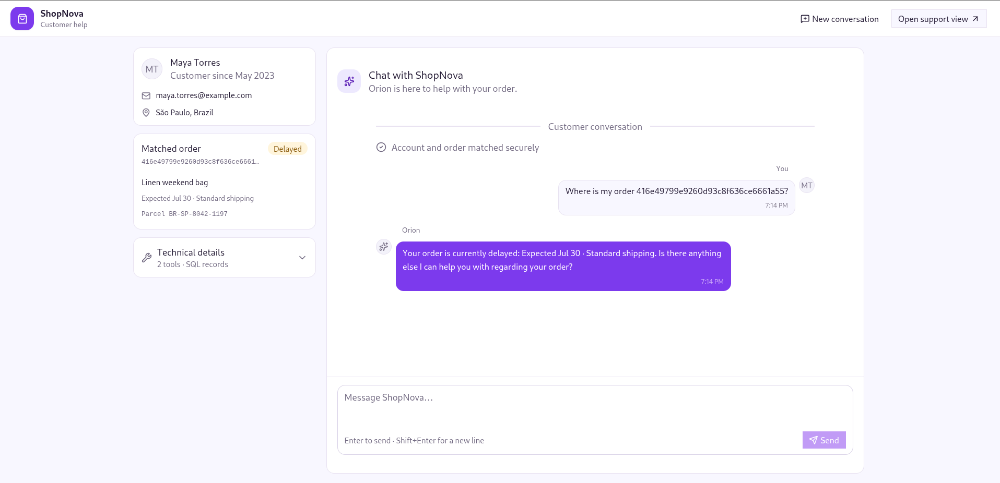
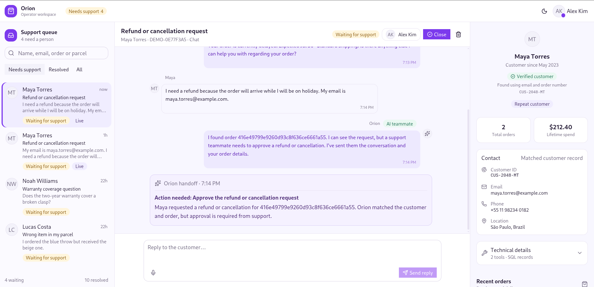
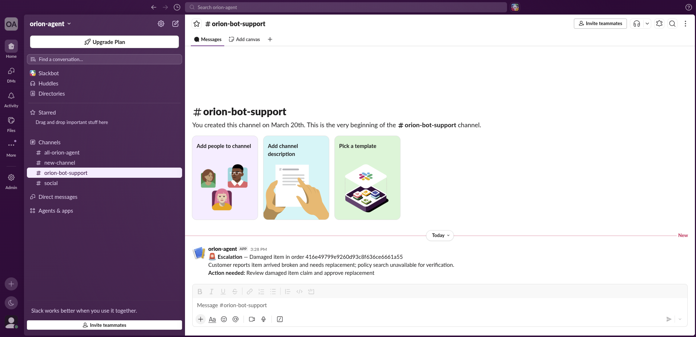
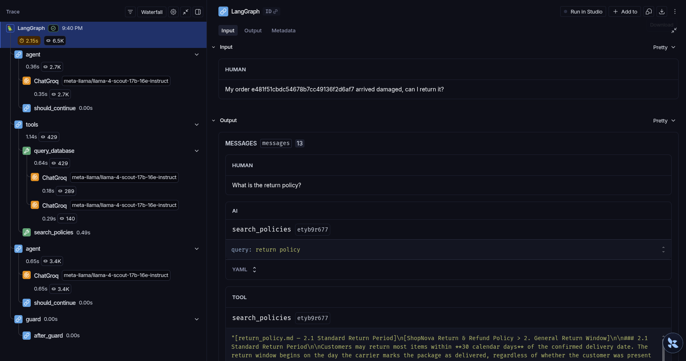

# Orion — AI Customer Support Agent

**Orion is a live AI support agent with a real human handoff** — a customer chats with Orion in `/customer`; Orion identifies them and their order from a database, resolves routine order-status and policy questions on the spot with sources shown, and hands unresolved cases to a support teammate who replies in the same thread from `/support`. Structured eval covers 154 labeled examples across 7 categories, including escalation and multi-turn scripts (historical 2-tool numbers below predate the current dataset and are kept for context, not as a current claim).

Built for e-commerce businesses tired of paying agents to answer the same questions on repeat. Orion resolves the repetitive tier-1 volume automatically and hands the rest to a person without the customer ever leaving the conversation or repeating themselves.

**Who this is for:** E-commerce businesses handling repetitive support volume — order status, returns, policy questions — who want most tickets resolved automatically and a clean handoff for the ones that need a person.

[](https://github.com/k-arvanitis/orion-agent/actions/workflows/ci.yml)


---

## What it does

- Identifies the customer and their order from a live database and resolves order-status questions (delivery, payment, freight) via Text2SQL over Supabase (Olist dataset)
- Answers policy questions — returns, shipping, payments, warranty — using hybrid dense+sparse RAG over Qdrant, with sources shown to the customer
- Combines order data and policy rules for mixed questions ("my order arrived late — am I eligible for a refund?")
- Escalates unresolved or explicitly requested cases to a human teammate, who replies in the same thread from `/support` — the customer never leaves the conversation
- Strips PII (Brazilian CPF numbers, phone numbers) from every response before it reaches the user
- Lets a support teammate dictate replies by voice via Groq Whisper transcription

**The problem.** Most e-commerce support tickets are not unique — they're the same handful of questions repeated thousands of times: *where is my order, can I return this, what payment methods do you accept, my package arrived damaged*. Each one costs an agent 5–10 minutes; the customer waits hours for a reply they could have had in seconds.

Built around a fictional Brazilian e-commerce store (ShopNova). The guided
customer/support demo uses clearly fictional CRM records seeded into a real SQL
schema so it is safe and repeatable. The provider-backed agent can separately
query the real [Olist dataset](https://www.kaggle.com/datasets/olistbr/brazilian-ecommerce)
in Supabase. Policy documents are synthetic and modelled on Brazilian
e-commerce regulations.

---

## Architecture

```
┌────────────────────┐        ┌────────────────────┐
│  /customer (chat)   │        │  /support (queue +  │
│                     │        │  conversation)      │
└──────────┬──────────┘        └──────────┬──────────┘
           │                              │
           └──────────── fetch (REST) ────┘
                          │
                          ▼
          ┌───────────────────────────────────────────┐
          │   FastAPI backend (uvicorn, :8088)         │
          │                                             │
          │  /api/support/*  → customers, orders,      │
          │                     conversations, replies  │
          │  /api/chat        → NDJSON stream (LangGraph)│
          │  /api/transcribe  → Groq Whisper             │
          │  /api/tts         → ElevenLabs               │
          └──────────┬──────────────────────┬───────────┘
                      │                      │
                      └──────────┬───────────┘
                                  ▼
                    ┌─────────────────────────────────┐
                    │  LangGraph ReAct Agent           │
                    │  (OrionState per thread_id)      │
                    │  needs an LLM key                │
                    │                                   │
                    │  ┌─────────┐ ┌────────┐ ┌───────┐ │
                    │  │RAG Tool │ │SQL Tool│ │Escalate│ │
                    │  │Qdrant   │ │Supabase│ │to human│ │
                    │  │dense+   │ │Text2SQL│ │        │ │
                    │  │sparse   │ │        │ │        │ │
                    │  └─────────┘ └────────┘ └───────┘ │
                    │  Guard layer (PII strip) on        │
                    │  every final response              │
                    └─────────────────────────────────────┘
                                  │
                                  ▼
                    support_store.py (identity match, SQLite/
                    Postgres CRM + conversation persistence)
```

One FastAPI app, one agent. `/api/support/*` (what `/customer` and `/support` actually talk to) and `/api/chat` both run through the same LangGraph agent (`orion_agent.agent.graph.run_turn` / `graph.invoke`) — customer/order identity matching stays a deterministic SQL lookup ahead of the agent call, but every response, tool choice, and escalation decision comes from the live agent. There is no scripted fallback path anymore: `/customer` needs `OPENROUTER_API_KEY` or `GROQ_API_KEY` configured and a populated Qdrant index (`make ingest`) to respond.

### API Endpoints

| Endpoint | Method | Description |
|----------|--------|-------------|
| `/api/health` | GET | Health check |
| `/api/chat` | POST | Provider-backed LangGraph agent — NDJSON streamed response |
| `/api/support/customers/lookup` | GET | Identity match for the demo path |
| `/api/support/conversations` | GET | List conversations (support queue) |
| `/api/support/conversations/messages` | POST | Post a customer message |
| `/api/support/conversations/{id}/reply` | POST | Support teammate reply |
| `/api/support/conversations/{id}/finish` | POST | Resolve/close a conversation |
| `/api/transcribe` | POST | Groq Whisper voice transcription |
| `/api/tts` | POST | ElevenLabs text-to-speech (backend only — unused in the current UI) |

Full interactive docs: `http://localhost:8088/docs`.

---

## Key engineering decisions

**Structured tool isolation** — tools return `{"answer": ..., "chunks/sql": ...}`. The agent receives only the `answer` field; raw source data is stored in `OrionState` for the UI trace panel. Prevents the LLM from reasoning about schema internals mid-conversation.

**PII guard before every response** — every final response passes through a regex filter that silently strips Brazilian CPF numbers and phone numbers before the text reaches the user. The filter runs after the ReAct loop completes and does not affect tool execution.

**Hybrid retrieval over pure semantic search** — policy documents contain exact terms ("30-day return window", "Boleto", "CPF") that dense-only search misses under paraphrase. BM25 handles keyword precision; the dense model handles intent. Both run in parallel via Qdrant prefetch and are fused with RRF — no learned weighting required.

**SELECT-only SQL validation** — generated queries are validated by sqlparse (DML rejection, markdown fence stripping) before execution. On failure, the error is fed back to the LLM for one retry. Natural language SQL injection is tested explicitly in the adversarial eval set.

**Partial failure resilience** — every external dependency degrades independently. RAG and SQL tools catch exceptions and return fallback messages without killing the other tool's response. The system never returns a silent empty answer.

## Design Decisions

**LangGraph over a simple LangChain chain.** A chain executes linearly and has no native concept of per-session state. Orion needs to remember the last retrieved chunks and SQL result across turns so the UI trace panel is always scoped to the current user. LangGraph's `OrionState` carries that state per `thread_id`, and the node/edge graph makes the routing logic inspectable — adding a new tool is a node, not a patch buried in a prompt.

**Qdrant over pgvector or Chroma.** Qdrant runs dense + sparse retrieval in a single prefetch query with built-in RRF fusion. pgvector requires two separate queries and manual reranking; Chroma has no sparse/BM25 support at all. For policy documents that contain exact regulated terms ("30-day return window", "Boleto", "CPF"), sparse retrieval is not optional — pure semantic search misses exact keyword matches under paraphrase.

**Local embeddings over a hosted API.** fastembed runs the BGE-small model locally via ONNX Runtime: no API key, no per-token cost, no quota to hit during eval runs (154 examples × multiple retries). After the one-time ~133 MB download, each embed takes ~2 ms. For a portfolio project that runs eval repeatedly, this pays for itself immediately.

**Evaluation harness over manual spot-checking.** 154 labeled examples across 7 categories with four measurement signals (custom LLM-as-judge faithfulness, answer relevancy, correctness, exact-match tool selection) means every change to the prompt, retrieval config, or model can be measured — not eyeballed. The `both` category (questions requiring RAG + SQL together) specifically exists because that failure mode is invisible without structured eval: the agent retrieves the right data from both tools but fails to combine them into a single answer. Faithfulness is intentionally restricted to `rag_only` cases — running it on `both_tools` answers is structurally invalid because the agent also draws on SQL data that isn't present in the retrieved RAG context.

---

## Evaluation

The eval harness runs **154 labeled question-answer pairs** across 7 categories, scoring the provider-backed LangGraph agent's RAG, Text2SQL, and escalation tools. The original 116 were generated with an LLM as a drafting tool, then manually reviewed for factual accuracy against the Olist dataset and synthetic ShopNova policy documents; the escalation, multi-turn, and additional both-tools cases added later reference real order IDs and payment/delivery data queried directly from the loaded Olist tables.

> **Stale after this change:** the agent gained a third tool,
> [`escalate_to_human`](#escalate_to_human--hand-off-to-a-support-teammate) —
> this dataset predates it and has no escalation category, so the **tool
> selection: 0.93** figure below no longer reflects the full 3-tool routing
> surface. Re-run `make eval` against a live LLM key before quoting this
> number in a pitch.

**Dataset breakdown:**

| Category      | Count | Description                                                                                         |
|---------------|-------|-----------------------------------------------------------------------------------------------------|
| `rag_only`    | 42    | Policy questions — returns, warranties, shipping rules, payment terms                               |
| `sql_only`    | 36    | Order-specific questions — status, delivery dates, payments, freight values                         |
| `both`        | 40    | Mixed questions requiring both order facts and policy rules, real orders from the loaded Olist DB   |
| `escalation`  | 15    | Requests needing human approval — damage/wrong/missing item, in-transit non-delivery, explicit human request, adverse reaction. Plus 5 negative cases spread across the categories above (frustrated tone, borderline late delivery) that must NOT trigger escalation |
| `multi_turn`  | 10    | Two-turn scripts on one thread — context carryover (order ID, category, policy topic), escalation reinforced on a follow-up, DB fact vs. an unverified customer claim |
| `edge_case`   | 6     | Corner cases — non-returnable items, expired boletos, late deliveries outside policy window         |
| `adversarial` | 5     | Prompt injection, out-of-scope questions, SQL injection in natural language, PII in query            |

`escalation`, `multi_turn`, and 10 of the `both` cases reference real order IDs, categories, and payment/delivery data pulled from the locally loaded Olist dataset rather than invented ones — seeded from real customer complaint patterns found in `order_reviews.review_comment_message`.

**Scoring:**

Each example is scored with up to 4 metrics. RAG metrics only apply to categories where chunks are retrieved.

| Metric             | Method                                                                          | Applies to          |
|--------------------|-----------------------------------------------------------------------------------|---------------------|
| Correctness        | LLM-as-judge (`gpt-4o-mini`, never the agent model) — scores 0–1 against expected answer | All                 |
| Tool selection     | Exact match against expected tool set — except `escalation`, which passes if `escalate_to_human` is among the tools called (the agent may gather order/policy facts first) | All |
| Faithfulness       | Custom claim-level judge — inferred conclusions count as supported; only contradictions and absent facts penalised | `rag_only` only |
| Answer relevancy   | LLM-as-judge — does the answer directly address the question?                   | All RAG categories  |

`multi_turn` cases run every turn sequentially on one `thread_id` before scoring the final turn's answer; tool selection is scored cumulatively across all turns in the script.

Faithfulness is restricted to `rag_only` — applying it to `both_tools` answers is structurally invalid because the agent also draws on SQL data absent from the RAG context.

**Results:** not yet re-run against the 154-case dataset above. orion-v9 (2026-05, 116 examples, 2-tool agent, a different judge model) is kept below for history only — it predates `escalate_to_human`, the escalation/multi-turn categories, and the current judge, so it is not comparable to a fresh run. See [the roadmap](docs/PLAN_2026-09-05.md) for the plan to re-run and replace this section.

<details>
<summary>orion-v9 results (2026-05, historical, not comparable)</summary>

| Metric             | Score | Examples |
|--------------------|-------|----------|
| Correctness        | 0.87  | 116      |
| Tool selection     | 0.93  | 111      |
| Faithfulness       | 0.97  | 44       |
| Answer relevancy   | 0.94  | 75       |

| Category       | n   | Correctness | Tool selection | Notes |
|----------------|-----|-------------|----------------|-------|
| `rag_only`     | 44  | **0.96**    | **1.00**       | Policy questions — near-perfect |
| `sql_only`     | 36  | **0.85**    | **0.97**       | Order lookups — occasional SQL generation error |
| `both`         | 31  | **0.78**    | **0.77**       | Mixed queries — primary failure surface |
| `none`         | 5   | **0.70**    | —              | Adversarial / out-of-scope |

</details>

**Where it failed (orion-v9, historical).** The `both` category — questions that need order facts *and* a policy rule (e.g. "my order arrived damaged, can I return it?") — is where most failures occur. The agent sometimes picks only one tool instead of both, or retrieves the right data from each but fails to synthesise them into a single answer. This is the category the eval was specifically designed to surface: it's invisible without structured measurement because each individual tool works correctly in isolation. The fix is a forced two-tool planning step before the ReAct loop — identified, not yet shipped.

```bash
make eval                                    # full run, saves to eval/orion-v12.json
make eval EVAL_EXPERIMENT=orion-v13          # custom experiment name
uv run --frozen python eval/run_eval.py --limit 5  # smoke test (5 examples)
```

---

## Tech Stack

| Component          | Technology                                                              | Why, not the alternative |
|--------------------|-------------------------------------------------------------------------|--------------------------|
| Orchestration      | LangGraph — stateful ReAct agent with custom `OrionState`               | Over a plain LangChain chain: LangGraph gives per-thread state, explicit node/edge routing, and clean tool-call visibility — a chain can't isolate session state or expose the trace panel without significant boilerplate |
| LLM                | OpenRouter — Qwen3 235B-A22B Instruct (`qwen/qwen3-235b-a22b-2507`)     | Uses one OpenAI-compatible endpoint while keeping the model and backend swappable through environment variables; Groq remains available as a chat fallback and powers Whisper transcription |
| RAG                | Qdrant — hybrid dense + sparse search with RRF fusion (local container by default, Qdrant Cloud via env) | Over pgvector: Qdrant runs dense + sparse in a single prefetch query with built-in RRF fusion; pgvector requires two separate queries and manual reranking. Over Chroma: Chroma has no sparse/BM25 support |
| Dense embeddings   | fastembed `BAAI/bge-small-en-v1.5` (384-dim)                            | Over a hosted embedding API (OpenAI, Cohere): zero latency, no quota, no key, no cost per token — the 133 MB model runs locally via ONNX Runtime at ~2 ms per embed after first-use download |
| Sparse embeddings  | BM25 via fastembed (`Qdrant/bm25`)                                      | Over dense-only: policy docs contain exact terms ("Boleto", "CPF", "30-day") that semantic search misses under paraphrase. BM25 handles keyword precision; dense handles intent — both are needed |
| Database           | Supabase PostgreSQL — Olist dataset, 9 tables                           | Over a local Postgres container: managed service with no infra overhead; free tier covers the demo dataset comfortably |
| Text2SQL           | same agent LLM + sqlparse validation + SQLAlchemy execution              | Over a dedicated Text2SQL library (e.g. vanna): full control over the prompt, schema injection, and retry logic; sqlparse SELECT-only validation adds a safety layer no library provides out of the box |
| Observability      | LangSmith                                                               | Over logging to stdout: LangSmith captures tool decisions, token counts, and latency per node in a queryable UI — essential for diagnosing the `both`-category failures in eval |
| Evaluation         | Custom LLM-as-judge harness (fully local, JSON output)                  | Over RAGAS + LangSmith: RAGAS faithfulness incorrectly penalises `both_tools` answers for SQL facts that aren't in the RAG context; LangSmith's free tier trace quota runs out mid-eval. The custom judge uses claim-level faithfulness (inferred conclusions count as supported), writes results to disk after every example, and has no external service dependency |
| Frontend           | Next.js 14 (App Router, TypeScript, Tailwind)                           | Over Streamlit: native token streaming via fetch + ReadableStream, a real component model for the trace sidebar, and voice via the browser MediaRecorder API — none of which are practical in Streamlit |
| Backend            | FastAPI + uvicorn                                                       | Thin HTTP boundary around the LangGraph agent; the same agent could front a Slack bot or mobile app without changes to agent logic |

## Tools

### `search_policies` — Hybrid RAG over policy documents

Embeds the query with **fastembed `BAAI/bge-small-en-v1.5`** (dense, 384-dim, local ONNX) and **BM25** (sparse, keyword-level, also fastembed). Qdrant runs both searches in parallel via prefetch, then fuses the ranked results with **Reciprocal Rank Fusion (RRF)** — no learned weighting needed. Returns the top 4 chunks.

Why hybrid: policy documents contain exact terms ("30-day return window", "Boleto", "CPF") that pure semantic search can miss. BM25 catches exact keyword matches; the dense model handles paraphrase and intent.

Returns `{"answer": "<formatted chunks>", "chunks": [{"source", "heading", "content"}]}`.

### `query_database` — Text2SQL over order data

Sends the question + schema context to the agent LLM, which generates a PostgreSQL SELECT query. The query is validated by **sqlparse** (SELECT-only whitelist) before execution. On failure, the error is fed back to the LLM for one retry. Results are interpreted back into natural language by the same LLM.

Returns `{"answer": "<natural language response>", "sql": "<query that ran>"}`.

### `escalate_to_human` — hand off to a support teammate

A structured signal tool — the agent invokes it when a request needs human approval (refund/cancellation), review before a replacement (damaged/wrong/missing item), or the customer explicitly asks for a person. The demo path (`/api/support/*`) reads the tool call's `subject`/`action_needed`/`reason` arguments to move the conversation to **Waiting for support**, where a teammate replies in `/support`. If `SLACK_WEBHOOK_URL` is configured, it also posts an alert to the operator Slack channel so a teammate doesn't have to poll the queue; unset, escalation still works, it just stays in-app only.

Returns `{"answer": "<confirmation for the customer>", "escalate": true, "subject", "action_needed", "reason"}`.

## Guard Layer

Every agent response passes through a PII filter before reaching the user:

**PII stripping** — regex removes Brazilian CPF numbers (`\b\d{3}\.\d{3}\.\d{3}-\d{2}\b`) and phone numbers (`\(\d{2}\)\s*\d{4,5}-\d{4}`) silently.

## Voice Mode

In `/support`, the reply box has a mic button: the browser captures audio with the native `MediaRecorder` API and posts it to `/api/transcribe`, which forwards to **Groq Whisper** (`whisper-large-v3-turbo`) and drops the transcript into the draft so a teammate can dictate a reply instead of typing it. It's dictation, not a voice conversation — the teammate still reviews and sends. `/api/tts` (ElevenLabs) exists on the backend as a standalone endpoint but nothing in the current UI calls it.

**Known limitations**

- Whisper is an external dependency; a transcription failure surfaces an error and leaves the draft untouched — it doesn't block typing a reply manually.
- Whisper accuracy on heavily accented English or noisy audio has not been measured against the eval set.

## Per-session State

Each conversation is identified by a `thread_id`. The provider-backed LangGraph agent persists its state (`OrionState` — messages, `last_chunks`, `last_sql`) via a `SqliteSaver` checkpointer (`data/checkpoints.db`, override with `CHECKPOINT_DB_PATH`), so conversations survive a service restart and the UI trace panel stays scoped to the current thread. The demo path's conversations live in the support database itself (`data/orion_support.db` by default), independent of the agent checkpointer.

---

## Demo

### Run the complete portfolio demo

```bash
make demo
```

Then open:

- `http://localhost:3500/customer` — what the customer sees
- `http://localhost:3500/support` — the support operator workspace
- `http://localhost:8088/docs` — interactive FastAPI documentation

`http://localhost:3500` redirects directly to the customer chat.

The `/customer` and `/support` demo path is driven by the same provider-backed
LangGraph agent as `/api/chat` — tool calls, escalation decisions, and
responses all come from the live agent, not a scripted fallback. It needs
`OPENROUTER_API_KEY` or `GROQ_API_KEY` and a populated Qdrant index
(`make ingest`) to respond. Customer/order identity matching stays a
deterministic SQL lookup ahead of the agent call, so `/api/support/*` never
guesses who it's talking to.

See [the 90-second demo guide](docs/DEMO_GUIDE.md) for the exact walkthrough
and [the roadmap](docs/PLAN_2026-09-05.md) for what is planned next.

**Demo video:** _add the hosted link here_ — 90-second `/customer` + `/support` walkthrough.





Escalation posts a live alert to the operator Slack channel (`SLACK_WEBHOOK_URL`):



Every agent run is traced in LangSmith — tool decisions, latency, and token usage.



**What Orion deflects automatically.** Order-status lookups, return/warranty/shipping/payment policy questions, and combined questions that need both ("my order arrived late — am I eligible for a refund?"). The agent answers from your live order database and your policy documents, with sources visible to the customer. No human in the loop.

**What it escalates — and how.** Frustrated customers, unresolvable issues, and explicit "I want a human" requests get handed off, not dropped. The conversation moves to **Waiting for support** with Orion's handoff summary and the matched customer/order context attached; a teammate opens it in `/support`, sees the full thread, and replies directly into it — the customer never leaves the conversation.

### Example Questions

**Order lookup (SQL)**
```
What is the status of order 416e49799e9260d93c8f636ce6661a55?
How much did I pay for order 1e8c81805b92ff169971231458670460?
```

**Policy lookup (RAG)**
```
What payment methods does ShopNova accept?
How long do I have to return a product?
```

**Multi-tool (SQL + RAG)**
```
My order arrived late — am I eligible for a refund?
I want to return order e481f51cbdc54678b7cc49136f2d6af7. How much will I get back?
```

**Escalation**
```
I want to speak to a real person. My email is customer@example.com.
```

---

## Setup

### Prerequisites
- Python 3.11 (pinned in `.python-version` and `pyproject.toml`)
- [uv](https://docs.astral.sh/uv/)
- Node.js ≥ 20 + npm (for the Next.js frontend)
- An ElevenLabs API key (only required for voice mode)

> Embeddings (dense + sparse) run locally via `fastembed`. No embedding API key, no daemon. The dense model (~133 MB) is downloaded into the Python cache on first use.

### Install
```bash
git clone https://github.com/k-arvanitis/orion-agent
cd orion-agent
uv sync --frozen
cd frontend && npm install && cd ..
```

### Environment variables
```bash
cp .env.example .env
```

For this local workspace, `make api`, `make demo`, and `make docker-up` reuse
only `OPENROUTER_API_KEY` from the sibling `../vault-rag/.env` when it exists.
Override that path with `OPENROUTER_ENV_FILE=/path/to/.env`, or put the key in
Orion's own `.env` in a standalone checkout.

Required keys:
```
DATABASE_URL=postgresql://...
QDRANT_URL=http://localhost:6337   # local container (make qdrant); or your Qdrant Cloud URL
QDRANT_API_KEY=                    # only for Qdrant Cloud
LLM_PROVIDER=openrouter
OPENROUTER_API_KEY=...
GROQ_API_KEY=...             # voice transcription; optional for text-only use
ELEVENLABS_API_KEY=sk_...      # voice mode only — omit if not using voice
```

Optional (enables LangSmith tracing for agent runs):
```
LANGCHAIN_API_KEY=...
LANGCHAIN_TRACING_V2=true
LANGCHAIN_PROJECT=orion-agent
```

### Ingest policies into Qdrant
```bash
make ingest    # starts the local Qdrant container (docker compose), chunks data/policies, embeds + upserts
```
Qdrant runs as a local container by default (`make qdrant`, host port `QDRANT_PORT`, default 6337).
Point `QDRANT_URL`/`QDRANT_API_KEY` at a Qdrant Cloud cluster for a hosted deployment; nothing else changes.

### Quick Start

```bash
make demo      # seed the SQL CRM + start API and UI (recommended)
make stack     # same services; also ensures the support database is seeded
# — or run them in separate terminals:
make api       # FastAPI backend (uvicorn, hot-reload on :8088)
make ui        # Next.js frontend (dev server on :3500)

make seed-support  # Create/seed the local support CRM database

make run       # CLI agent (no frontend)
make test      # run all Python tests
make eval      # run evaluation — results saved to eval/orion-v12.json
```

> **Port already in use?** Override with `make api API_PORT=8088` and `make ui API_PORT=8088 WEB_PORT=3500`. The Next.js dev server picks up `NEXT_PUBLIC_API_BASE_URL` from the environment.

Open `http://localhost:3500/support` for the operator workspace and
`http://localhost:3500/customer` for the customer-side demo.

Open `/customer` and `/support` in separate tabs when presenting the project.
The compact technical-details panels show the tools and SQL records used for
each conversation.

The support demo uses a real relational database, not frontend fixtures or
browser storage. By default it creates `data/orion_support.db` with normalized
customers, customer tags, products, orders, conversations, and messages. Set
`SUPPORT_DATABASE_URL` to a valid PostgreSQL/Supabase URL to use the same API
and UI against a hosted database.

### Quality Gates

Ruff is configured in `pyproject.toml`:

```toml
[tool.ruff]
line-length = 88
target-version = "py311"

[tool.ruff.lint]
select = ["E", "F", "I"]
```

CI runs `uv run ruff check .` before the test suite.

### Docker

`docker-compose.yml` brings up three services: Qdrant (`:6337` on the host), the FastAPI backend on `:8088`, and the Next.js frontend on `:3500`. External services (OpenRouter, Supabase, Groq Whisper, ElevenLabs) are reached over the network via keys in `.env`. Embeddings run inside the API container via `fastembed` — no separate embedding service.

```bash
cp .env.example .env       # fill in your keys
make docker-build          # builds api + ui images
make docker-up             # starts api (8088) + ui (3500)
```

Then open `http://localhost:3500/customer` and `http://localhost:3500/support`.

> **Note:** The containers do not include your Supabase data, and the Qdrant volume starts empty. Run `make ingest` once to populate it before the RAG tool returns results.

### Failure Modes

| Failure                | Behaviour                                                                                                    |
|------------------------|--------------------------------------------------------------------------------------------------------------|
| **LLM provider error** | Provider errors are surfaced by LangGraph. Check `LLM_PROVIDER`, its API key, and `AGENT_MODEL` in `.env`. |
| **Qdrant unreachable** | `search_policies` catches the exception and returns *"Policy search temporarily unavailable."* SQL still works. |
| **Embedding model load fails** | First-use download or ONNX init raises; `search_policies` returns the same *"temporarily unavailable"* fallback. SQL still works. |
| **Supabase / DB down** | `query_database` retries once then returns *"Unable to retrieve that information."* RAG still works.         |
| **PII in response**        | Guard strips CPF and phone numbers silently before the response reaches the user.                      |

### Tests

```bash
make test
```

50 tests, no external services required — OpenRouter/Groq, remote Qdrant, Supabase, ElevenLabs, Slack, the dense encoder, and the FastAPI surface are all mocked or replaced by local test fixtures.

| File                       | What it tests                                                          |
|----------------------------|--------------------------------------------------------------------------|
| `test_escalate_tool.py`    | Escalation payload shape, Slack webhook skipped when unset, posted when set |
| `test_guard.py`            | PII stripping (CPF, phone), GuardResult flags                          |
| `test_routing.py`          | `should_continue` routing logic, checkpointer connection stays open    |
| `test_sql_validation.py`   | SELECT-only validation, DML rejection, markdown fence stripping        |
| `test_rag_tool.py`         | Structured JSON response, chunk metadata, Qdrant / dense-encoder failure fallbacks |
| `test_voice.py`            | Whisper transcribe + ElevenLabs synthesize (Groq + ElevenLabs mocked)  |
| `test_llm.py`              | Chat-model factory — OpenRouter vs Groq selection, missing-key errors  |
| `test_api.py`              | FastAPI endpoints — chat NDJSON stream (lazy agent load + degrade-clean), transcribe, tts, validation, error paths |
| `test_support_api.py`      | Seeded SQL CRM, database-derived overview, identity matching, status routing, and persisted support replies |

---

## Known limitations

- **Numeric fact cross-checking not implemented** — prices and dates in agent responses are not verified against raw tool output. Mitigations in place: SELECT-only SQL validation prevents fabricated queries, RAG answers are grounded in retrieved chunks (97% faithfulness in eval), and PII is stripped before responses reach the user. A production deployment should add a verification step that cross-checks numeric claims against the raw tool result.
- **Thread state is persisted, not distributed** — the LangGraph checkpointer (`SqliteSaver`, `data/checkpoints.db`) survives a service restart but is a single local file. For a multi-instance deployment it would need to move to Postgres or Redis.
- **Embedding model load time on first call** — fastembed downloads ~133 MB of BGE weights into the venv cache on first use (one-off, ~5 s on a typical broadband line). Subsequent embeds are ~2 ms; no network call after that.
- **Single-tenant eval dataset** — the 154-case eval set was generated from the Olist schema and synthetic ShopNova policies. Scores are not directly comparable to general-purpose customer support benchmarks.
- **Hosted LLM limits under eval load** — a full concurrent eval can hit provider limits. The `--limit` flag exists for smaller smoke runs; `LLM_PROVIDER` and `AGENT_MODEL` can be changed without modifying agent code.

---

## Project structure

```
orion-agent/
├── src/orion_agent/agent/
│   ├── config.py             # Centralised config — all model names and defaults
│   ├── llm.py                # Chat-model factory — OpenRouter preferred, Groq fallback
│   ├── embeddings.py         # fastembed BGE dense + fastembed BM25 sparse
│   ├── graph.py               # LangGraph ReAct agent with OrionState (SqliteSaver-backed), run_turn()
│   ├── guard.py               # PII filter (CPF, phone)
│   ├── prompts.py             # System prompt with tool reasoning + escalation rules
│   ├── voice.py                # Voice I/O: Groq Whisper + ElevenLabs
│   └── tools/
│       ├── rag_tool.py       # Hybrid Qdrant search — returns structured JSON
│       ├── sql_tool.py       # Text2SQL over Supabase — returns structured JSON
│       └── escalate_tool.py  # Structured handoff signal + optional Slack alert
├── ingestion/
│   ├── chunker.py            # Markdown → heading-based chunks
│   ├── ingest.py              # Embed + push to Qdrant (dense + sparse)
│   ├── load_customer_data.py # CSV → Supabase with automatic type inference
│   └── seed_support_data.py  # Create/seed the local support CRM database
├── eval/
│   ├── run_eval.py           # Local eval harness (4 metrics, 154 cases incl. multi-turn, results → JSON)
│   ├── judge.py               # Custom claim-level LLM judge (faithfulness + answer relevancy)
│   └── dataset.json           # 154 labeled test cases across 7 categories
├── api/
│   ├── main.py                # FastAPI app: /api/support/*, /api/chat, /transcribe, /tts
│   ├── schemas.py             # Pydantic request/response models
│   └── support_store.py      # SQLite/Postgres CRM + conversations — the live demo path
├── frontend/                 # Next.js 14 UI — shadcn (base-nova), dark mode
│   ├── app/
│   │   ├── layout.tsx        # Root layout + no-flash theme init
│   │   ├── globals.css        # Tailwind + CSS-variable colour tokens (light/dark)
│   │   ├── page.tsx           # Redirects to /customer
│   │   ├── customer/page.tsx # Customer chat: identity match, resolve, or request handoff
│   │   └── support/page.tsx  # Ticket queue + conversation + customer/order sidebar
│   ├── components/
│   │   ├── ConversationPanel.tsx # Support-side thread: history, reply box, voice dictation
│   │   ├── CustomerSidebar.tsx   # Customer/order context panel
│   │   ├── TicketQueue.tsx       # Needs support / Resolved / All ticket list
│   │   ├── TechnicalDetails.tsx  # Tools called, SQL, retrieved chunks (customer page)
│   │   ├── VoiceRecorder.tsx     # MediaRecorder mic button (dictation only)
│   │   ├── OrionLogo.tsx         # Brand mark (shopping-bag glyph, matches ShopNova header)
│   │   ├── ThemeToggle.tsx       # Light/dark switch (persists to localStorage)
│   │   └── ui/                    # shadcn primitives (Bubble, Message, Field, Sheet, ...)
│   ├── lib/
│   │   ├── support-api.ts    # fetch wrappers for /api/support/*
│   │   ├── support-data.ts   # Ticket/message/customer TS types
│   │   ├── api.ts              # transcribeAudio() — the one still-used /api/transcribe wrapper
│   │   └── types.ts            # Trace/Chunk types mirroring api/schemas.py
│   ├── components.json       # shadcn config (base-nova preset)
│   ├── package.json           # Next 14 + React 18 + Tailwind + shadcn deps
│   └── Dockerfile              # multi-stage Node build
├── tests/
│   ├── test_escalate_tool.py
│   ├── test_guard.py
│   ├── test_routing.py
│   ├── test_sql_validation.py
│   ├── test_rag_tool.py
│   ├── test_voice.py
│   ├── test_llm.py
│   ├── test_api.py
│   └── test_support_api.py
├── docs/
│   ├── DEMO_GUIDE.md         # 90-second walkthrough for /customer + /support
│   └── PLAN_2026-09-05.md    # Roadmap: eval, scaling to real company data, hardening
├── data/
│   └── policies/               # Markdown policy documents (4 files)
├── .github/workflows/ci.yml  # CI — ruff + tests on every push
├── docker-compose.yml          # qdrant + api + ui
├── main.py                     # CLI entry point
├── Makefile                    # make demo / stack / api / ui / qdrant / test / eval / ingest / seed-support
└── .env.example
```

---

## Contact

Built by Konstantinos Arvanitis — AI engineer specialising in LangGraph agents and RAG systems for SMBs.

- [LinkedIn](https://www.linkedin.com/in/konstantinos-arvanitis-0248b3246/)
- [GitHub](https://github.com/k-arvanitis)
- Email: konstantinos.arvanitis@outlook.com
</content>
